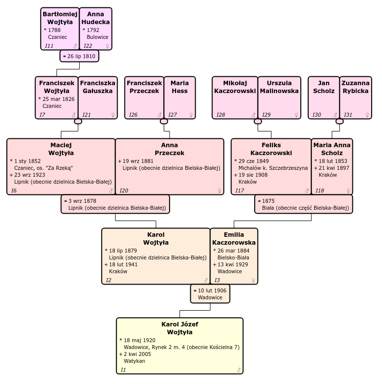

# Topola Genealogy Viewer

[](https://github.com/PeWu/topola-viewer/actions/workflows/node.js.yml)

View your genealogy data using an interactive chart.

Website: https://pewu.github.io/topola-viewer

<p align="center">
  <a href="https://pewu.github.io/topola-viewer/#/view?url=http%3A%2F%2Fgenpol.com%2Fmodule-Downloads-prep_hand_out-lid-32.html">
    
  </a>
</p>

## Features
* Hourglass chart
* All relatives chart
* Click on a person to focus
* Open standard GEDCOM files you can export from any genealogy application
* Load from URL (just point to a GEDCOM file on the Web)
* Privacy – your files do not leave your computer
* Print the whole genealogy tree
* Export to PDF, PNG, SVG
* Side panel with details
* Permalinks when loading from URL
* Cool transition animations

[Changelog](CHANGELOG.md)

## Examples

Here are some examples from the Web:

* [Karol Wojtyła](https://pewu.github.io/topola-viewer/#/view?url=http%3A%2F%2Fgenpol.com%2Fmodule-Downloads-prep_hand_out-lid-32.html) (from [GENPOL](http://genpol.com/module-Downloads-display-lid-32.html))
* [Shakespeare](https://pewu.github.io/topola-viewer/#/view?url=https%3A%2F%2Fwebtreeprint.com%2Ftp_downloader.php%3Fpath%3Dfamous_gedcoms%2Fshakespeare.ged) (from [webtreeprint.com](https://webtreeprint.com/tp_famous_gedcoms.php))

If you have data in a genealogy database, you can export your data in GEDCOM format and load it using the "Load from file" menu.

## Integrations

Topola Genealogy Viewer is being integrated into more and more Web and desktop applications.
Here are the current integrations:

### Gramps

To view your [Gramps](https://gramps-project.org/) data in Topola Genealogy Viewer,
install [*Interactive Family Tree*](https://gramps-project.org/wiki/index.php/Interactive_Family_Tree)
plugin from the Gramps plugin manager. The plugin will add a
*Tools->Analysis and Exploration->Interactive Family Tree* menu item to Gramps.

Source code: https://github.com/gramps-project/addons-source/tree/master/Topola

### Webtrees

Embed Topola Genealogy Viewer in your [Webtrees](https://www.webtrees.net/) installation with the
[Topola interactive tree addon](https://www.webtrees.net/index.php/en/add-ons/download/3-modules/247-topola-interactive-tree).
Webtrees 2.0 is not supported yet.

Source code: https://github.com/PeWu/topola-webtrees

### WikiTree

You can browse the [WikiTree](https://www.wikitree.com/) genealogy tree using Topola Genealogy Viewer.
On a WikiTree profile page go to the *Family Tree & Tools* tab and click the *Dynamic Tree by Topola* link.

Example:
[Stephen Hawking](https://apps.wikitree.com/apps/wiech13/topola-viewer/#/view?source=wikitree&standalone=false&indi=Hawking-7)

Topola Genealogy Viewer is hosted on [apps.wikitree.com](https://apps.wikitree.com/apps/wiech13/topola-viewer)
to benefit from the ability of being logged in to the WikiTree API.

## Running locally

```
npm install
npm start
```
