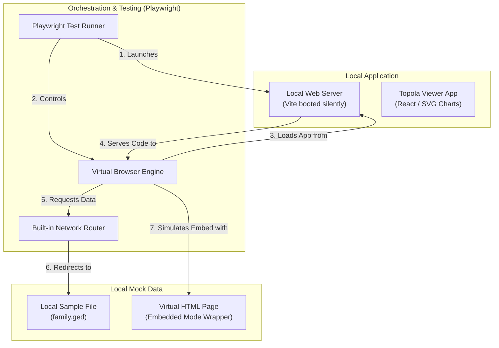

# Playwright E2E Testing Design Document

## 1. Business & Functional Problem Statement

Topola Viewer currently relies on a Cypress end-to-end (E2E) test suite to verify critical user flows, such as interactive chart rendering, search capabilities, and experimental WebMCP integrations. However, the existing setup is brittle and hard to maintain because it depends on live, external internet connections to fetch remote GEDCOM trees, uses loosely-typed JavaScript spec files, and suffers from complex process orchestration. Additionally, Cypress's historical architectural limitations make testing cross-origin iframe structures in embedded mode slow and difficult to simulate locally. Migrating this testing suite to Playwright in TypeScript will establish a fast, fully type-safe, hermetic, and self-contained validation pipeline, ensuring absolute quality control and deployment confidence.

## 2. The Technical Plan

The technical solution relies on transitioning our testing engine from Cypress to Playwright, utilizing a self-contained, local-first execution model. Instead of relying on external servers or separate terminal scripts to boot up our application, Playwright will orchestrate the entire lifecycle from start to finish.

Here is a block diagram of how the major components fit together during a test run:



### Breakdown of Major Components

#### 1. The Playwright Test Runner
The central brain of our testing environment. It handles parsing our TypeScript test specifications, managing test execution, starting the local web server, controlling the virtual browser instances, and generating reports.

#### 2. The Local Web Server (Vite / Preview)
A local server hosting the Topola Viewer application. To ensure E2E tests validate the exact production bundle that will be deployed, the test runner in CI environments boots the production-built files via Vite's preview server (`npx vite preview --port 3000 --strictPort`), with the build process decoupled and executed earlier in the CI workflow job. Local environments dynamically run Vite dev server (`npx vite --no-open --port 3000 --strictPort`) or reuse an existing running server to maintain fast iteration cycles.

#### 3. The Built-in Network Router (Interception)
The central network traffic controller. When the application attempts to fetch the family tree, our network router intercepts the request and returns our offline sample data instead. To prevent browser CORS blocks, the mock response explicitly supplies the `Access-Control-Allow-Origin: *` header. Wildcard interceptors match any request ending with `/family.ged`, allowing E2E tests to load family tree data consistently from local mock data without hardcoding public GitHub URL paths or relying on CORS proxy overrides.

#### 4. The Virtual Page Generator (Iframe Wrapper)
A mechanism for generating temporary webpage wrappers directly in-memory during test execution. To simulate how our app works inside an iframe, Playwright serves a dynamic wrapper page on a mock URL `/test-embedded-frame.html`. This wrapper page loads our app inside an iframe and handles standard bidirectional postMessage handshakes. Because the application uses `HashRouter`, the iframe source points to the hash route `/#/view?embedded=true&handleCors=false` to ensure React Router matches the `/view` route.

#### 5. The Browser Environment Injector (Init Scripts)
Allows the test runner to pre-configure the browser's environment before the web page's own code executes. This is essential for simulating experimental features like WebMCP tool registration. The injector exposes a mock registration API that pushes registered tools to the browser's global `window.__registeredTools` array. The runner evaluates execution blocks *inside* the browser context to invoke these tools' non-serializable callbacks, asserting tool registration and visual UI updates.

## 3. Alternatives Considered & Rejected

To establish clear architectural guardrails and prevent future regressions or redundant work, this section documents the key design alternatives that were evaluated and subsequently ruled out.

### A. Phased Migration (Coexistence)
* **Considered:** Running both Cypress and Playwright concurrently in the repository and migrating the five test specs one by one over time.
* **Rejected because:** Dual-framework coexistence introduces significant developer friction and technical debt. Developers would have to maintain duplicate configuration files, manage dual dependency pools in `package.json`, and configure complex dual execution stages in GitHub Actions. Given our E2E suite is compact, a "clean break" eliminates Cypress-related dependencies immediately.

### B. Running E2E Tests Against Live URLs (Real-World Feeds)
* **Considered:** Continuing the Cypress pattern of loading the sample family tree directly from GitHub raw servers over the public internet.
* **Rejected because:** Live URL calls in automated E2E tests are a primary source of test flakiness. Tests can fail randomly due to DNS resolution lags, server downtime, or GitHub API rate-limiting, causing false negatives in our CI pipeline. Using Playwright's network routing to intercept these calls and fulfill them with a local fixture guarantees absolute hermeticity and consistency.

### C. Maintaining Physical HTML Wrapper Files for Iframe Tests
* **Considered:** Storing a physical `tests/fixtures/embedded_frame.html` file in the repository to act as the container for iframe tests.
* **Rejected because:** Storing a physical, standalone test-only wrapper file can create environment port synchronization issues and static asset mapping overhead.
* **Actual Implementation Note:** The implementation adopted a hybrid approach. A physical template file [embedded_frame.html](../tests/fixtures/embedded_frame.html) is maintained as the structural source of truth for the frame, but it is loaded in-memory and served virtually on `/test-embedded-frame.html` via the network router, keeping it on the same origin/port dynamically to bypass cross-origin iframe blocks.

### D. Retaining `start-server-and-test` for Dev Server Bootstrapping
* **Considered:** Continuing to rely on `start-server-and-test` or a custom bash script to verify when port `3000` is responsive before running tests.
* **Rejected because:** Playwright's native `webServer` orchestrator is superior, highly optimized, and self-contained. It handles port polling, processes recycling on failures, and performs automatic process cleanups upon exit natively. Keeping `start-server-and-test` adds unnecessary external library dependencies and script complexity.

### E. Initial Multi-Browser & Multi-Device Targets
* **Considered:** Configuring Chromium, Firefox, WebKit, and mobile emulation from Day One.
* **Rejected because:** The immediate goal is to achieve full, stable parity with the existing single-browser Cypress suite. Adding multiple engines right away increases execution time and CI resource consumption. Multi-browser testing can be easily enabled later by adjusting the configuration in `playwright.config.ts`.

## 4. Detailed Implementation Plan

This section defines the granular step-by-step instructions and enumerates **every single file** that will be created, modified, or deleted to ensure a flawless migration, including complete, copy-pasteable code contents for all configurations and test specifications matching the actual implementation.

### A. Enumeration of Files

#### 1. Files to [DELETE]

*   **[cypress.config.ts](../cypress.config.ts)**
    *   *Rationale:* Complete removal of Cypress configurations; no longer needed.
*   **[cypress/e2e/chart_view.cy.js](../cypress/e2e/chart_view.cy.js)**
    *   *Rationale:* Outdated JavaScript test spec. Replaced by type-safe `tests/chart_view.spec.ts`.
*   **[cypress/e2e/embedded.cy.js](../cypress/e2e/embedded.cy.js)**
    *   *Rationale:* Outdated JavaScript test spec. Replaced by type-safe `tests/embedded.spec.ts`.
*   **[cypress/e2e/intro.cy.js](../cypress/e2e/intro.cy.js)**
    *   *Rationale:* Outdated JavaScript test spec. Replaced by type-safe `tests/intro.spec.ts`.
*   **[cypress/e2e/search.cy.js](../cypress/e2e/search.cy.js)**
    *   *Rationale:* Outdated JavaScript test spec. Replaced by type-safe `tests/search.spec.ts`.
*   **[cypress/e2e/webmcp.cy.js](../cypress/e2e/webmcp.cy.js)**
    *   *Rationale:* Outdated JavaScript test spec. Replaced by type-safe `tests/webmcp.spec.ts`.
*   **`cypress/e2e/README.md`**
    *   *Rationale:* Legacy test documentation that is no longer applicable.

#### 2. Files to [MODIFY]

*   **[package.json](../package.json)**
    *   *Rationale:* Uninstall `cypress` and `start-server-and-test` devDependencies. Install `@playwright/test` and `@types/node`. Add the silent `"preview": "vite preview"` script, replace the `cy:*` test scripts with Playwright E2E execution targets (`"test:e2e": "playwright test"` and `"test:e2e:ui": "playwright test --ui"`), and update the `"prettier"` and `"lint"` scripts to format and lint both the `src/` and `tests/` directories.
*   **[jest.config.ts](../jest.config.ts)**
    *   *Rationale:* Add the `roots` configuration property to isolate Jest unit testing to the `src/` directory, preventing Jest from scanning or executing Playwright specs inside the `tests/` folder.
*   **[.gitignore](../.gitignore)**
    *   *Rationale:* Ignore locally generated Playwright E2E testing artifacts (`playwright-report/`, `test-results/`, and `.playwright/`) to maintain a clean working tree.
*   **[PROJECT_STRUCTURE.md](../PROJECT_STRUCTURE.md)**
    *   *Rationale:* Replace references to Cypress (`cypress/`, `cypress.config.ts`) with Playwright (`tests/`, `playwright.config.ts`) to keep the repository structural documentation fully accurate.
*   **[.github/workflows/node.js.yml](../.github/workflows/node.js.yml)**
    *   *Rationale:* Replace `npm run cy:start-and-run` with cached Playwright execution. E2E tests are executed across all matrix Node environments to maximize testing coverage and parity across runtimes.
*   **[.github/workflows/deploy-gh-pages.yml](../.github/workflows/deploy-gh-pages.yml)**
    *   *Rationale:* Remove testing and browser-setup steps entirely to speed up the deployment flow and separate deploy actions from regular test gating.
*   **[.github/workflows/deploy-wikitree-apps.yml](../.github/workflows/deploy-wikitree-apps.yml)**
    *   *Rationale:* Remove testing and browser-setup steps entirely to speed up the deployment flow and separate deploy actions from regular test gating.

#### 3. Files to [NEW]

*   **[playwright.config.ts](../playwright.config.ts)**
    *   *Rationale:* Central configuration for Playwright. Configures parallel execution, defines a single Desktop Chrome (Chromium) project, sets the base URL and locale to `'en-US'`, and manages the local dev or preview servers dynamically on port 3000 with strict port enforcement.
*   **`tests/tsconfig.json`**
    *   *Rationale:* Custom localized compiler configuration for E2E tests that extends the root `tsconfig.json` but includes NodeJS environment types explicitly and isolates global types from Jest, keeping E2E environments perfectly isolated. It sets `"noEmit": true` because E2E tests do not need to output compiled JS files.
*   **`tests/global.d.ts`**
    *   *Rationale:* Custom global type declaration file for E2E tests to safely declare `__registeredTools` on the `Window` interface without TypeScript compiler warnings. Redundant overrides for `Navigator` are omitted because the test suite inherits it from the application's core WebMCP declarations.
*   **`tests/helpers.ts`**
    *   *Rationale:* Shared test utilities to encapsulate wildcard route mocking for family tree fetching (`setupGedcomRoute`) and tracking interception (`blockTracking`). This avoids code duplication across spec files.
*   **`tests/fixtures/embedded_frame.html`**
    *   *Rationale:* Physical template wrapper file defining the iframe and message-passing structure for embedded view E2E verification.
*   **`src/datasource/testdata/test.ged`**
    *   *Rationale:* Instead of checking in a duplicate fixture file, we directly read the existing version-controlled test GEDCOM dataset located at `src/datasource/testdata/test.ged` inside the Playwright interceptors. This eliminates file duplication, reduces repository footprint, and ensures a single source of truth.
*   **`tests/intro.spec.ts`**
    *   *Rationale:* Type-safe TS spec checking landing page layout, menu items, and basic static DOM presence.
*   **`tests/chart_view.spec.ts`**
    *   *Rationale:* Type-safe TS spec checking interactive tree navigation, relying on Playwright's auto-waiting to settle D3 transitions, drawer details panels, and routing interception to block analytics/third-party APIs.
*   **`tests/search.spec.ts`**
    *   *Rationale:* Type-safe TS spec checking the search autocompletion (using robust, user-facing locators like `page.getByPlaceholder('Search for people')` to target the input, and Playwright's auto-waiting to handle search debouncing).
*   **`tests/webmcp.spec.ts`**
    *   *Rationale:* Type-safe TS spec verifying WebMCP tools. Emulates out-of-process tool executions inside `navigator.modelContext` by evaluating execution blocks within the browser context, using polling assertions to avoid React `useEffect` mount race conditions.
*   **`tests/embedded.spec.ts`**
    *   *Rationale:* Type-safe TS spec verifying iframe embedded views using a virtually served template file `tests/fixtures/embedded_frame.html` executing the bidirectional postMessage handshake (`ready` / `gedcom`) matching production.

### B. Step-by-Step Execution Plan & Complete File Contents

#### Step 1: Dependency Purge & Clean Break
1. Remove legacy Cypress and server-tester modules from `package.json`:
   `npm uninstall cypress start-server-and-test`
2. Delete the `cypress.config.ts` configuration and the recursive `cypress/` folder from disk.
3. Install Playwright Test Framework and Node environment types:
   `npm install -D @playwright/test @types/node`
4. Download the local browser binaries required for Playwright execution:
   `npx playwright install chromium`
5. Update the `"prettier"` script in `package.json` to cover both `src/` and `tests/`:
   `"prettier": "prettier --write \"{src,tests}/**/*.{ts,tsx,json}\""`
6. Modify `jest.config.ts` to isolate Jest testing to the `src/` directory and prevent test scanning collisions:
   ```typescript
   // Add this property to the exported config object in jest.config.ts
   roots: ["<rootDir>/src"],
   ```
7. Update the repository structural documentation [PROJECT_STRUCTURE.md](../PROJECT_STRUCTURE.md) to replace Cypress details with Playwright details.

#### Step 2: Script Alignment & Silent Configs
1. Update the `package.json` scripts:
   * Add `"preview": "vite preview"` to support serving the production build in CI.
   * Replace `cy:*` script targets with Playwright E2E commands:
     * `"test:e2e": "playwright test"`
     * `"test:e2e:ui": "playwright test --ui"`
2. Author `playwright.config.ts` to orchestrate the `webServer` dynamically based on execution context, and poll port `3000`.

**Key Configuration Details for [playwright.config.ts](../playwright.config.ts):**
* **Test Directory**: Target `./tests` folder.
* **Parallelism & CI Tuning**: Enable fully parallel execution (`fullyParallel: true`), disable `forbidOnly` locally but enforce it in CI, and configure retries (2 in CI, 0 locally).
* **Base Configuration**: Set the `baseURL` to `http://localhost:3000`, force the locale to `'en-US'` to ensure consistent translation keys across all runs, and capture traces on first retry.
* **Browsers**: Set up a single project using standard Chromium devices (`Desktop Chrome`).
* **Orchestrated WebServer**: Configure `webServer` to run the Vite dev server (`npx vite --no-open --port 3000 --strictPort`) locally or Vite preview (`npx vite preview --port 3000 --strictPort`) in CI, targeting port `3000` with strict port enforcement and reusing any existing local server instance only in local mode.

#### Step 3: Establish Test Directories & Compile Settings
1. Create the folder path `tests/` and its subfolder `tests/fixtures/`.
2. Author `tests/tsconfig.json` to isolate test typings from the main application and Jest unit tests:
   * **Inheritance & Target**: Extends the root `tsconfig.json`, setting `module` and `moduleResolution` to `NodeNext` and targeting `ES2022`.
   * **Isolated Types**: Excludes Jest/app global typings and explicitly pulls in only the `"node"` types.
   * **No Output**: Sets `"noEmit": true` as E2E specs do not need compilation output.
3. Author `tests/global.d.ts` to provide TypeScript type definitions for mocked window objects:
   * **Type Extension**: Declares `__registeredTools?` on the global `Window` interface to prevent TypeScript compilation errors during WebMCP mocks.
4. Author `tests/helpers.ts` to provide reusable mock setups and routing interceptions:
   * **Tracking Blockers**: Implements a `blockTracking(context)` helper that intercepts and aborts requests targeting Google Analytics and Tag Manager (`**/*google-analytics.com/**`, `**/*googletagmanager.com/**`) to guarantee hermetic and fast test execution.
   * **GEDCOM Mocks**: Implements a `setupGedcomRoute(context)` helper that reads the version-controlled local dataset (`src/datasource/testdata/test.ged`) and routes all requests matching `**/family.ged` to be fulfilled with it, serving a `200 OK` response with CORS enablement headers (`Access-Control-Allow-Origin: *`).
5. Author the physical template wrapper file `tests/fixtures/embedded_frame.html` for testing embedded iframe communications:
   * **Structure**: Defines a standard wrapper document housing an iframe that points to the app's embedded route: `/#/view?embedded=true&handleCors=false`.
   * **Bidirectional Handshake**: Contains script block executing a `fetch()` to get the GEDCOM content. It listens for a `'ready'` postMessage from the child iframe, and posts the raw GEDCOM content back with a `'gedcom'` message once the handshake is complete.

#### Step 4: Spec Translation & Spec Designs

##### 1. Intro Test (`tests/intro.spec.ts`)
Checks the landing page layout, menu items, and basic static DOM presence:
* **Setup**: Leverages `beforeEach` to block analytics and tracking servers using the `blockTracking` helper, then loads the index page (`/`).
* **Assertions**:
  * Verifies that the main intro landing text content (specifically checking for the presence of `'Examples'`) is visible on the page.
  * Asserts that core action buttons in the menu (exact text `'Open file'` and `'Load from URL'`) are properly rendered and visible to the user.

##### 2. Chart View Test (`tests/chart_view.spec.ts`)
Checks tree navigation, settles transitions, details panels, and routing interception:
* **Setup**: Employs `beforeEach` to configure route intercepts via `setupGedcomRoute` and navigates to the app passing a mock URL parameter (`/#/view?url=https%3A%2F%2Fexample.org%2Ffamily.ged`).
* **Assertions**:
  * Verifies that the viewer loads and renders the chart nodes, asserting that the name `'Bonifacy'` is visible inside the `#content` container.
  * Tests chart interactive capabilities by clicking an individual node (e.g., `'Radobod'`) with `{force: true}` to navigate, asserting that a child node (e.g., `'Chike'`) animates and renders.
  * Verifies side-drawer details rendering by asserting that person-specific data (e.g., `'a random note'`) is visible.

##### 3. Search Test (`tests/search.spec.ts`)
Checks search input, suggestion popups, debouncing, and navigation updates:
* **Setup**: Prepares GEDCOM routing via `setupGedcomRoute` and loads the chart view.
* **Assertions**:
  * Targets the search input using the user-facing selector `page.getByPlaceholder('Search for people')`.
  * Fills in search queries (e.g., `'chik'`), verifies the autocomplete results panel (`.results`) debounces and renders the target suggestion (`'Chike'`).
  * Triggers selection by pressing `'Enter'` and asserts that the main chart view successfully shifts focus and renders the target person's node.

##### 4. WebMCP Test (`tests/webmcp.spec.ts`)
Bridges out-of-process serialization, checks tool registrations, and asserts detail updates:
* **Setup**: Configures GEDCOM intercepts. Prior to navigation, it injects an early script (`page.addInitScript`) that mocks `navigator.modelContext.registerTool` and `navigator.modelContext.unregisterTool` APIs, populating tool metadata in a global `window.__registeredTools` list.
* **Assertions**:
  * Verifies all core WebMCP tools (`get_selected_person`, `search_indi`, `inspect_indi`, `focus_indi`, `find_relationship_path`, `get_ancestors`, `get_descendants`) register correctly. Uses a polling assertion (`page.waitForFunction`) to safely wait for the React hook mounting cycle.
  * Tests interactive integration by evaluating a script in the browser context that calls the registered `focus_indi` tool callback with target identifier (`{id: 'I21'}`), then asserts that the UI automatically updates the viewer focus to `'Chike'`.

##### 5. Embedded Test (`tests/embedded.spec.ts`)
Serves local wrapper page template virtually and handles complete bidirectional postMessage handshake:
* **Setup**: Prepares standard GEDCOM routing. Reads the physical `embedded_frame.html` template from disk and registers a route interceptor serving it dynamically at `/test-embedded-frame.html` so both frames stay on the same origin.
* **Assertions**:
  * Navigates to `/test-embedded-frame.html`.
  * Targets the inner iframe using `page.frameLocator('#topolaFrame')`.
  * Verifies that the bidirectional message passing functions correctly by asserting that the inner iframe successfully receives and renders the root family chart nodes (asserting the presence of `'Bonifacy'`).

#### Step 5: CI Pipeline Alignment

Modify the GitHub Actions YAML scripts in `.github/workflows/` to replace all legacy Cypress execution steps. E2E testing runs on all Node environments in the pipeline matrix for comprehensive validation.

##### 1. Key Steps for `node.js.yml`
* **Prettier & Lint Checks**: Run formatting checks across both the application and the new tests using `npx prettier --check "{src,tests}/**/*.{ts,tsx,json}"` and run `npm run lint`.
* **Build & Test**: Run standard `npm run build` and unit tests via `npm test`.
* **E2E Spec Typecheck**: Run `npx tsc -p tests/tsconfig.json --noEmit` to guarantee complete E2E spec compilation/type correctness.
* **Playwright Browser Caching**: Extract the current Playwright version and cache the browser binaries (`~/.cache/ms-playwright`) dynamically using `actions/cache@v4` to prevent redundant downloads.
* **Execution**: Install necessary OS libraries using `npx playwright install-deps chromium`, install the browser binary, and run the test runner with `npm run test:e2e`.
* **Artifact Storage**: Archive the resulting `playwright-report/` directory on failure or completion using `actions/upload-artifact@v4` with a 30-day retention period.

##### 2. Key Steps for `deploy-gh-pages.yml` & `deploy-wikitree-apps.yml`
* No testing steps are run within the deploy workflows. They are fully streamlined to execute checkouts, build production assets, and deploy immediately, leaving gating assertions to the primary merge-to-master CI loop (`node.js.yml`).

## 5. Future Considerations

### A. Visual Regression (Screenshot) Testing
While the initial migration focuses on full parity with standard Cypress text-assertion specs, Topola Viewer is a highly visual, SVG-driven charting engine. In a future iteration, we should introduce Playwright visual snapshot/regression testing using `expect(page.locator('#content svg')).toHaveScreenshot('default-chart.png')`. This will automatically catch layout regressions, overlaps, and styled box positioning issues that DOM text assertions cannot detect.

### B. File Upload Flow Testing
To ensure users can reliably upload their family trees locally, a future iteration should introduce E2E tests for local file ingestion:
* **Single File Upload (.ged)**: Simulating selection and upload of `.ged` text files using Playwright's `setInputFiles()` or `filechooser` events, verifying that the application correctly transitions to the visual chart view.
* **Multi-File / Image Upload**: Verifying that uploading a `.ged` file along with associated `.jpg` or `.png` image assets resolves and binds photos to individuals in the chart without errors.
* **Fixture Management**: This will require checking in small, 1x1 pixel dummy images to act as local mock visual resources.

### C. CI/CD Pipeline Optimization (Shared E2E Gating Job)
Currently, the manual deployment workflow `deploy-everywhere.yml` triggers both `deploy-gh-pages.yml` and `deploy-wikitree-apps.yml` in parallel, which duplicates E2E test execution and results in running the slow Playwright test runner twice simultaneously. A future optimization should restructure the workflows to execute the E2E validation once as a gating pre-deploy job (`needs: e2e-validation`), or rely strictly on the main merge-to-master CI pipeline validation, ensuring manual deployments are fast, clean, and lightweight.
