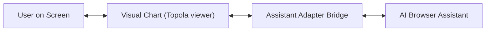

# WebMCP Interface Design

## The Problem
Exploring large genealogy charts can be overwhelming and time-consuming because users have to manually search, click, and scroll through hundreds of interconnected family branches just to find simple answers. To make this experience intuitive and modern, we are adding an interactive AI layer that acts as a research copilot directly inside the browser. This will allow users to effortlessly ask questions like "how is John related to Mary" or command the map to focus on specific relatives using simple natural conversation. Ultimately, this makes genealogy research accessible to everyone, letting users engage with their ancestry without wrestling with complex navigation controls.

## System Architecture (How it works)
To make this feature work, we bridge three simple components together to let the map and the Assistant communicate smoothly:

1. **The Visual Chart (Topola core):** This is what you see on your screen. It draws the family members, sets up transitions, and tracks who you are currently looking at.
2. **The Assistant Adapter (The Bridge):** A singleton instance class (`WebMcpBridge`) instantiated once in `App.tsx` and running in the background. It acts as a continuous translator, giving the assistant access to read and move the active user chart while preventing disconnected side variables and state memory leaks.
3. **The AI Command Registry (WebMCP):** The external plug that allows the browser AI to issue predefined commands (such as "Focus on Sarah" or "Get direct descendants") to the Assistant Adapter.



This setup lets the AI control the tree smoothly without rebuilding the viewer from scratch. It behaves much like a second pair of hands working beside you on the same controls.

## Rejected Alternatives (Design Guardrails)
To ensure consistent development and avoid repeating past defaults, here are the alternate designs considered but discarded during early setup:

* **Pushing real-time events for layout clicks:** We evaluated building a reactive push model that constantly updates the AI on every user click in real-time. We rejected this in favor of passive standard queries (`get_selected_person()`) because constant pushes can confuse the assistant and bloat the UI event stream.
* **A single combined Focus & Details tool:** We considered having one command perform both view manipulation and metadata inspection. We split these into isolated fetch commands (`inspect_indi`) and camera viewport shifts (`focus_indi`) so reading relatives stays fast and doesn't accidentally jerk the user's screen viewpoint.
* **Relying solely on recursive tool loops for deep trees:** Initially, direct single-node queries were considered enough for relationships. We rejected leaving the AI to fetch single nodes repeatedly in favor of generational acceleration commands (`get_ancestors` bounded to 5 generations ceiling) to protect interactive performance latency.
* **Internal fuzzy date parser algorithms:** We decided against writing standard regex parser logic for partial or approximate genealogy records (e.g., `"ABT 1750"`, `"BEFORE 1800"`). Instead, raw in-flight text string dumps allow standard conversational LLMs to contextualize approximation by themselves.
* **Module-scoped global state variables:** Rejected in favor of a single static bridge instance (Singleton pattern) initialized inside the React application frame. This prevents loose standard closures and allows isolated updates for new file uploads.
* **Custom synchronous DOM events for state queries:** Considered dispatching events from tools and capturing them inside React components. Rejected due to overhead constraints and event emitter latency.

## Exposed MCP Tools

To enable smooth AI communication, the following tools are exposed to the LLM. Returned individual details are structured into three level tiers:

* **`IndiReference`:**
```json
{
  "type": "object",
  "properties": {
    "id": { "type": "string" },
    "name": { "type": "string" }
  },
  "required": ["id", "name"]
}
```

* **`BasicIndi`:**
```json
{
  "type": "object",
  "properties": {
    "id": { "type": "string" },
    "name": { "type": "string" },
    "birth": {
      "type": "object",
      "properties": {
        "date": { "type": "string" },
        "place": { "type": "string" }
      }
    },
    "death": {
      "type": "object",
      "properties": {
        "date": { "type": "string" },
        "place": { "type": "string" }
      }
    },
    "mother": { "$ref": "#/definitions/IndiReference" },
    "father": { "$ref": "#/definitions/IndiReference" }
  },
  "required": ["id", "name"]
}
```

* **`FullIndi`:**
```json
{
  "type": "object",
  "properties": {
    "id": { "type": "string" },
    "name": { "type": "string" },
    "birth": {
      "type": "object",
      "properties": {
        "date": { "type": "string" },
        "place": { "type": "string" }
      }
    },
    "death": {
      "type": "object",
      "properties": {
        "date": { "type": "string" },
        "place": { "type": "string" }
      }
    },
    "mother": { "$ref": "#/definitions/BasicIndi" },
    "father": { "$ref": "#/definitions/BasicIndi" },
    "children": {
      "type": "array",
      "items": { "$ref": "#/definitions/BasicIndi" }
    },
    "spouses": {
      "type": "array",
      "items": {
        "type": "object",
        "properties": {
          "spouse": { "$ref": "#/definitions/BasicIndi" },
          "marriage": {
            "type": "object",
            "properties": {
              "date": { "type": "string" },
              "place": { "type": "string" }
            }
          }
        },
        "required": ["spouse"]
      }
    }
  },
  "required": ["id", "name"]
}
```

### 1. `get_selected_person`
Returns the individual currently selected in the browser viewport. This corresponds to the person displayed in the side panel, which is not necessarily the focused person.
* **Request Schema:** 
  ```json
  { "type": "object", "properties": {} }
  ```
* **Response Schema:** `FullIndi`

### 2. `search_indi`
Searches the genealogy index for individuals by name. Returns at most 20 results to maintain fast performance and reasonable payload sizes.
* **Request Schema:**
  ```json
  {
    "type": "object",
    "properties": {
      "query": { "type": "string", "description": "The name of the person to search for." }
    },
    "required": ["query"]
  }
  ```
* **Response Schema:** Array of `BasicIndi` (maximum 20 items).

### 3. `inspect_indi`
Fetches isolated detailed information for a specific individual by ID pointer.
* **Request Schema:**
  ```json
  {
    "type": "object",
    "properties": {
      "id": { "type": "string", "description": "The pointer ID of the individual." }
    },
    "required": ["id"]
  }
  ```
* **Response Schema:** `FullIndi`

### 4. `focus_indi`
Instructs the Topola viewer camera view to center on and focus a specific relative node. This will also update the side panel to show the focused person.

> [!NOTE]
> Changing focus prompts a full redesign layout sweep to center that person. This creates high UX layout jitter if the assistant uses it repetitively.

* **Request Schema:**
  ```json
  {
    "type": "object",
    "properties": {
      "id": { "type": "string", "description": "The pointer ID to focus." }
    },
    "required": ["id"]
  }
  ```
* **Response Schema:**
  ```json
  { "type": "object", "properties": { "status": { "type": "string" } } }
  ```

### 5. `find_relationship_path`
Traverses the internal graph model to find relative step paths between two individuals. The following links should be traversed: parent, child, spouse, sibling.
* **Request Schema:**
  ```json
  {
    "type": "object",
    "properties": {
      "source": { "type": "string", "description": "Start individual ID pointer" },
      "target": { "type": "string", "description": "End individual ID pointer" }
    },
    "required": ["source", "target"]
  }
  ```
* **Response Schema:** Array of `BasicIndi` establishing the sequence.

### 6. `get_ancestors`
Traverses upwards up to bounded ceiling generations.
* **Request Schema:**
  ```json
  {
    "type": "object",
    "properties": {
      "id": { "type": "string", "description": "Target individual ID" },
      "generations": { "type": "number", "description": "Depth bound" }
    },
    "required": ["id"]
  }
  ```
* **Response Schema:** Array of `BasicIndi`

### 7. `get_descendants`
Traverses downwards up to bounded ceiling generations.
* **Request Schema:**
  ```json
  {
    "type": "object",
    "properties": {
      "id": { "type": "string", "description": "Target individual ID" },
      "generations": { "type": "number", "description": "Depth bound" }
    },
    "required": ["id"]
  }
  ```
* **Response Schema:** Array of `BasicIndi`

## Constraints and Assumptions
* **Family Structure Assumptions:** The WebMCP integration assumes simplified family structures (e.g., single set of biological parents per individual). Multiple marriages are fully supported, consistent with the core Topola Viewer app design.
* **Privacy Boundaries:** The WebMCP tools must strictly follow the privacy constraints of the Topola Viewer. For instance, private profiles (such as WikiTree restricted profiles) must be filtered and hidden from the AI assistant and its tool responses.
* **Cycle Protection:** All graph traversal algorithms (e.g., finding ancestors and descendants) must implement internal cycle protection (e.g., tracking visited node pointers) to avoid endless iteration loops caused by standard pedigree collapse.
* **Legacy Replacement:** WebMCP tool creation must strictly overwrite and replace the existing tools previously defined in `src/webmcp.ts` to avoid duplicate hooks.
* **Relationship Pathfinder:** Topola viewer does not have prebuilt pathfinder operators. `find_relationship_path` must be manually implemented from scratch using a standard Breadth-First Search (BFS) algorithm traversing parent, child, spouse, and sibling links.
* **Index searching reuse:** The tool `search_indi` must borrow standard `buildSearchIndex` from `src/menu/search_index.ts` already powering the top search UI instead of deploying newly written independent fuzzy match loops.
* **Data Format Standards:** WebMCP tool integration consumes Topola's pre-parsed core JSON formats (`JsonGedcomData`, `JsonIndi`) instead of low-level raw GEDCOM pointer lines to enforce implementation consistency and operational efficiency.

## Detailed Implementation Plan
This section lists the exact files to be created or modified to execute this design successfully.

#### 1. [Modify] [webmcp.ts](../src/webmcp.ts)
* **Rationale:** Serves as the core integration plug for the experimental WebMCP browser assistant setup and standard operational in-memory state cache. 
* **Action steps:**
  * Define isolated state stores for current `selection`, `detailIndi`, and `loadedGedcomData`.
  * Refactor current custom callbacks to register the complete tools collection blueprint (`search_indi`, `inspect_indi`, `focus_indi`, `get_ancestors`, `get_descendants`, `find_relationship_path`) into the `navigator.modelContext` array hook.
  * Expose default standard state setters for Topola view adapter.
  * Implement conversion and response helpers (`toMcpResponse`, `textMcpResponse`, `toBasicIndi`, `toFullIndi`) to standardise in-transit JSON streams.

### 2. [NEW] [webmcp_definitions.ts](../src/webmcp_definitions.ts)
* **Rationale:** Keeps standard LLM tool definition blueprints separate from the execution bridge to avoid bloat and single interface monolithic designs.

### 3. [NEW] [webmcp_types.ts](../src/webmcp_types.ts)
* **Rationale:** Defines ambient `navigator.modelContext` parameters and concrete structural bridge types cleanly.

### 4. [Modify] [app.tsx](../src/app.tsx)
* **Rationale:** The top-level state component for Topola Viewer. It holds the interactive chart state and needs standard side effect hooks to update the WebMCP context on active selections.
* **Action steps:**
  * Initialize WebMCP Bridge securely using `useState(() => new WebMcpBridge())` avoiding loose disconnected singleton memory leaks.
  * Add standard `React.useEffect` hook to monitor active viewport selection changes and feed them into the WebMCP in-transit state.
  * Expose selection and inspection callbacks handlers to the bridge hook preset.

### 5. [Modify] [gedcom_util.ts](../src/util/gedcom_util.ts)
* **Rationale:** Handles core conversion formulas from raw gedcom pointers to JSON objects. Houses newly proposed BFS algorithms avoiding visual rendering components dependency.
* **Action steps:**
  * Implement standard Breadth-First Search (BFS) method for isolated `find_relationship_path` relative footprint.
  * Draft flat array collection algorithms (bounded up to preset depth ceiling) for ancestors and descendants generation list.

### 6. [Modify] [gedcom_util.spec.ts](../src/util/gedcom_util.spec.ts)
* **Rationale:** Standard isolated unit test suite. It must accommodate boundary tests for newly added generic algorithms.
* **Action steps:**
  * Add unit test cases for `find_relationship_path` with disconnected and connected multi relationships.
  * Add test vectors for `get_ancestors` boundary ceilings (e.g., 5 generations) and cycles control.

### 7. [New] [webmcp.cy.js](../cypress/e2e/webmcp.cy.js)
* **Rationale:** Formatted test files acting as automated integration coverage. Leverages Cypress stubs for isolated web tools inspection.
* **Action steps:**
  * Mock `navigator.modelContext` using `cy.visit` on before preset lifecycle hooks.
  * Trigger tool actions and check default DOM element shifts in simulated Topola frames.


## Testing Strategy
To ensure the robustness and correctness of the WebMCP integration, we will employ a multi-tiered testing approach spanning unit, integration, and manual end-to-end tests.

### Unit Tests
* **Graph Traversal Algorithms:**
  * Test `find_relationship_path` with multiple scenarios:
    * Direct descendants (e.g., Parent to Child).
    * Sibling and cousin relationships.
    * Pedigree collapse (cycles in the family tree).
    * Unrelated individuals (should return an empty list or appropriate error).
  * Test `get_ancestors` and `get_descendants` with generation bounds (e.g., limit = 5) and deep pedigree setups to verify the boundary ceilings and internal cycle protection.
* **Search indexing:** Test `search_indi` to verify it delegates correctly to the core search index and correctly limits the size of the response payload to at most 20 items.

### Integration Tests
* Standard UI integration tests are implemented using **Cypress**.
* The `navigator.modelContext` can be stubbed using Cypress `onBeforeLoad` hook to verify standard registration callbacks on application setup frame.
* The integration suite tests:
  * Core tool callbacks correctly transition the React internal viewport selection.
  * Application changes in selected person correctly propagate into in-transit operational state without rendering glitches.

### Manual Verification
* Because interactive tools are bound to the experimental WebMCP protocol, manual verification can be accelerated using the **Model Context Tool Inspector Chrome Extension**. This grants operational developers a dashboard panel to trigger and fire tools independently inside standard dev viewports.

### Files Created or Modified for Testing
* **[Modify] [gedcom_util.spec.ts](../src/util/gedcom_util.spec.ts)**
  * **Rationale:** Contains existing unit tests for GEDCOM data structures. It will be extended to verify the newly introduced relationship finding and bounded graph traversal algorithms without visual overhead.
* **[New] [webmcp.cy.js](../cypress/e2e/webmcp.cy.js)**
  * **Rationale:** Will act as the dedicated automated integration suite for the WebMCP feature. It will stub `navigator.modelContext` to verify correct tool registration and that standard execution callbacks successfully sync back layout and selection changes inside the Topola visual DOM.

## Future Considerations
* **AI Canvas & Camera controls:** Exposing interactive UI commands such as canvas zoom and shifting the chart views (e.g., hourglass, donatso) could be added in future increments as additional tool blueprints.
